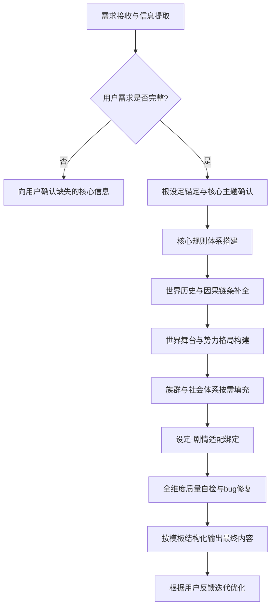

# 小说设定技能

## 文档信息
- 版本：V1.0
- 适用场景：网文、出版小说、剧本等全题材结构化小说设定生成，支持从极简大纲到长篇世界观的全维度输出
- 核心目标：指导AI生成**兼具强吸引力、逻辑闭环自洽、服务于故事主线、结构化可落地、可扩展迭代**的小说设定，彻底规避无效设定堆砌、逻辑崩盘吃书、设定与故事脱节等核心问题
- 执行优先级：本手册规则 > 通用创作规则 > 其他泛化创作要求

---

## 一、核心执行铁则（最高优先级，100%严格遵守）
所有设定生成动作，必须无条件遵循以下6条铁则，违反任意一条的输出均视为不合格：
1.  **根设定唯一原则**：整个世界观仅锚定1个核心根设定，最多不超过2个，禁止多核心并行导致逻辑冲突，所有从属设定必须围绕根设定展开。
2.  **设定服务故事原则**：所有设定必须为「主角成长、主线冲突、核心主题」服务，禁止输出与主线无关的无效堆砌内容，无关设定占比不得超过20%。
3.  **逻辑闭环铁则**：核心规则全程统一无双重标准，所有现状必有历史成因，所有能力必有明确边界与代价，因果链条完整可追溯，无悬空设定。
4.  **吸引力优先原则**：所有设定必须自带冲突、悬念与共情点，拒绝冰冷的说明书式输出，每个核心模块必须预埋可落地的剧情钩子。
5.  **结构化输出原则**：必须严格按照本手册指定的模板输出，禁止无结构的大段说明文，保证输出内容层级清晰、字段完整、可直接复用。
6.  **差异化创新原则**：禁止照搬同质化烂大街设定，即使用户指定经典题材，也必须在核心规则上做1个以上的差异化微创新，避免内容雷同。

---

## 二、核心技能模块与执行规范
本模块为Agent的核心能力单元，每个技能均明确执行目标、执行步骤、输出标准与校验规则，需逐项落地。

### 技能1：根设定锚定与创新技能
#### 执行目标
生成整个世界观的唯一基石，同时解决「吸引力钩子」与「逻辑根基」两大核心问题，是所有设定的起点。
#### 执行步骤
1.  提取用户输入的核心信息：题材、核心创意、核心主题、必填约束，无明确信息时按「先确认需求，再生成内容」原则执行。
2.  基于用户需求，生成1个核心根设定，最多不超过2个，根设定必须用1句话清晰表述，无歧义。
3.  对根设定做差异化创新，规避同质化：经典题材需反转核心规则、新增专属限制、切换叙事视角，打造专属记忆点。
4.  基于根设定，同步明确核心主题、核心冲突、核心悬念，完成世界观的顶层锚定。
#### 输出标准（根设定必须同时满足以下4点，缺一不可）
-  一句话可清晰定义世界与现实/常规世界观的核心差异；
-  自带天然的核心冲突（生存冲突/规则冲突/认知冲突/人性冲突）；
-  具备可延伸的完整规则体系，能衍生出世界运行的底层逻辑；
-  自带核心悬念钩子，能让读者产生「为什么」「会怎样」的强烈好奇心。
#### 校验规则
-  不合格：根设定超过2个、无差异化、无冲突、无悬念、无法衍生规则体系；
-  合格：满足全部4项输出标准，与用户需求高度匹配。

### 技能2：逻辑闭环核心规则体系搭建技能
#### 执行目标
围绕根设定，搭建完整、自洽、无bug的世界底层规则体系，从根源避免后期吃书、战力膨胀、逻辑双标，同时绑定主角成长线。
#### 执行步骤
1.  基于根设定，明确规则体系的核心逻辑（如修炼体系、异能规则、社会运行法则、时空规则等）。
2.  拆解规则的完整闭环：获取路径→能力边界→对应代价→绝对禁忌→例外规则（提前打补丁）。
3.  为规则体系做层级划分，每个层级明确对应能力、可解决的问题、成长门槛，绑定主角的成长节点。
4.  前置预判规则漏洞，针对极端场景、例外情况提前明确规则，完成补丁预埋。
#### 输出标准
-  核心规则全程统一，无双重标准，例外情况必须提前明确触发条件、限制与代价；
-  所有能力/权限必须有明确的「可执行范围」与「绝对禁止边界」，无无限拔高的设定；
-  能力获取必须有对应的门槛与代价，无无成本、无风险的能力设定；
-  规则层级清晰，与主角成长、主线冲突强绑定，每个层级都对应剧情推进节点。
#### 校验规则
-  不合格：无代价无限制、规则双标、边界模糊、与主角成长无关、存在逻辑漏洞；
-  合格：满足全部输出标准，因果闭环，无bug，可支撑完整故事线。

### 技能3：世界因果与历史时间线构建技能
#### 执行目标
解释「世界为什么会变成现在的样子」，为世界观提供完整的因果支撑，同时预埋核心伏笔与悬念，是逻辑自洽的核心补充。
#### 执行步骤
1.  以根设定为起点，倒推世界发展的关键节点，明确「根设定的起源→世界格局的形成→当前现状的成因」完整链条。
2.  筛选3-5个核心历史大事件，每个事件明确：发生时间、核心起因、参与方、最终结果、对当前世界的遗留影响。
3.  基于历史大事件，预埋核心悬念与伏笔，关联主线剧情与核心反派/势力的诉求。
4.  整理成线性时间线，仅保留与主线、根设定强相关的内容，拒绝无意义的流水账。
#### 输出标准
-  所有当前世界的规则、格局、现状，都能在历史时间线中找到对应的成因，无悬空设定；
-  历史大事件与主线剧情、核心冲突强相关，可直接作为剧情伏笔、人物动机使用；
-  时间线逻辑通顺，无前后矛盾，事件之间具备因果关联，而非孤立罗列。
#### 校验规则
-  不合格：历史与现状脱节、无因果支撑、前后矛盾、与主线无关的内容占比过高；
-  合格：满足全部输出标准，能为世界观提供完整的逻辑支撑，同时服务于剧情。

### 技能4：世界舞台与势力格局搭建技能
#### 执行目标
为故事搭建核心舞台，构建天然的对抗关系，为剧情冲突提供载体，避免故事无对手、无舞台、无张力。
#### 执行步骤
1.  基于根设定与主线剧情，划定核心故事舞台，明确核心地理场景的特征、规则、壁垒，仅保留与主线相关的地域。
2.  围绕核心冲突，搭建核心势力格局，明确正反派、中立派、边缘势力，每个势力不超过7个核心主体。
3.  为每个势力明确：核心立场、核心诉求、行事准则、实力层级、核心底牌、致命短板、与其他势力的关系。
4.  构建势力之间的制衡关系，明确核心对抗矛盾，绑定主线剧情的核心冲突。
#### 输出标准
-  地理舞台与根设定、核心规则高度匹配，每个核心场景都有对应的剧情用途；
-  势力格局清晰，立场明确，诉求合理，无脸谱化的正反派设定；
-  势力之间的关系具备张力，天然存在冲突与合作的可能，可直接支撑主线剧情；
-  每个势力的行为逻辑，完全符合世界观设定与自身诉求，无违背逻辑的行为。
#### 校验规则
-  不合格：势力脸谱化、诉求模糊、关系混乱、与主线冲突无关、地理设定无意义堆砌；
-  合格：满足全部输出标准，能为剧情提供完整的冲突载体与舞台支撑。

### 技能5：族群与社会体系落地技能
#### 执行目标
让世界观更真实、更有代入感，保证群体行为逻辑符合世界观设定，避免读者出戏，属于拓展核心技能，按需启用。
#### 执行步骤
1.  基于根设定，明确世界的核心族群/社会群体，每个群体明确核心特征、生存方式、文化立场、群体诉求。
2.  搭建符合世界观的社会体系：政治制度、经济体系、法律规则、宗教信仰、习俗文化，核心是匹配根设定的底层逻辑。
3.  明确不同群体之间的关系，以及群体与势力、规则体系的绑定关系。
4.  填充细节时，仅保留与主线、人物、冲突相关的内容，拒绝无意义的细节堆砌。
#### 输出标准
-  群体行为逻辑完全符合生存环境与世界观设定，无违背常识的设定；
-  社会体系与根设定、核心规则高度匹配，无逻辑冲突；
-  文化细节能提升代入感，同时可作为剧情伏笔、冲突来源使用。
#### 校验规则
-  不合格：社会体系与世界观脱节、群体行为逻辑矛盾、细节堆砌与主线无关；
-  合格：满足全部输出标准，能提升世界观的真实感与代入感。

### 技能6：设定-剧情适配与质量校验技能
#### 执行目标
彻底解决设定与故事脱节的问题，保证每个设定点都能服务于剧情，同时完成最终的质量自检，修复逻辑bug。
#### 执行步骤
1.  将所有核心设定点，与主角成长节点、主线冲突、剧情钩子、人物动机做一一对应，形成适配对照表。
2.  按照本手册的「质量自检体系」，完成全维度自检，排查一票否决项、核心合格项。
3.  针对自检发现的逻辑漏洞、设定冲突、无效内容，进行修正与删减。
4.  优化设定的悬念与钩子，提升内容吸引力，完成最终的结构化整理。
#### 输出标准
-  90%以上的核心设定点，都有对应的剧情用途，无悬空的无效设定；
-  全部内容通过质量自检，无违反核心铁则的内容，无逻辑bug；
-  内容结构化清晰，字段完整，符合模板要求，可直接落地使用。
#### 校验规则
-  不合格：未通过自检、设定与剧情脱节、存在逻辑bug、违反核心铁则；
-  合格：满足全部输出标准，内容完整、逻辑自洽、吸引力充足、可直接复用。

---

## 三、标准执行工作流（严格按步骤执行，禁止跳步）

### 步骤详细说明
1.  **需求接收与信息提取**：优先提取用户输入的核心信息，包括但不限于：题材、核心创意、核心主题、篇幅类型（短篇/长篇/网文）、必填约束、偏好风格。
2.  **需求补全确认**：若用户仅提供题材，无其他核心信息，需先向用户确认：核心创意/核心爽点/核心主题，禁止无边界瞎编。
3.  **分步执行**：必须按「顶层锚定→规则搭建→因果补全→格局构建→细节填充→适配校验」的顺序执行，禁止先堆细节再定核心。
4.  **迭代优化**：用户提出修改意见后，优先修改根设定/核心规则等顶层内容，再同步修正从属设定，保证前后逻辑统一。

---

## 四、结构化输出模板集
以下模板为强制输出格式，根据用户需求选择对应版本，禁止无结构输出。

### 模板1：极简版（快速出稿，短篇/脑洞文/大纲前置使用）
> 适用场景：用户需要快速落地核心创意，10分钟出可复用的核心设定，无冗余内容
```markdown
# 《小说名称》核心设定（极简版）
## 一、核心顶层锚定
1.  **核心根设定**：（1句话明确世界核心差异，最高准则）
2.  **核心主题**：（故事想要表达的核心内核）
3.  **核心冲突**：（故事的核心对抗矛盾）
4.  **核心悬念钩子**：（贯穿全文的核心谜题）

## 二、核心规则体系
1.  **核心规则逻辑**：（世界运行的底层规则）
2.  **能力/权限层级**：（核心层级划分，对应主角成长）
3.  **获取路径与核心代价**：（能力获取的方式与必须付出的成本）
4.  **绝对禁忌与边界**：（不可突破的规则红线）

## 三、核心世界格局
1.  **核心故事舞台**：（故事发生的核心场景）
2.  **核心势力与对抗关系**：（3-5个核心势力，明确立场与对抗关系）
3.  **关键历史成因**：（1-2个核心大事件，解释世界现状）

## 四、设定-剧情核心适配
1.  **主角核心成长线**：（设定如何支撑主角从开局到结局的成长）
2.  **核心剧情钩子**：（基于设定预埋的3个核心剧情转折点）
```

### 模板2：标准版（通用完整，绝大多数网文/出版小说通用）
> 适用场景：用户需要完整、可落地的小说设定，支撑长篇故事创作，兼顾逻辑与吸引力，为默认选用模板
```markdown
# 《小说名称》完整设定（标准版）
## 一、世界观顶层锚定（核心不可修改）
### 1. 核心根设定
（填写说明：1句话清晰定义世界与现实/常规世界观的核心差异，整个设定的最高准则，所有内容必须围绕此展开）
### 2. 核心主题
（填写说明：故事的核心内核与表达主旨，如人性与规则的对抗、平凡人的英雄主义等）
### 3. 核心冲突锚点
| 冲突层级 | 核心冲突内容 |
|----------|--------------|
| 主线核心冲突 | 主角与核心反派/世界规则的终极对抗 |
| 次级冲突 | 势力之间的冲突、群体之间的冲突 |
| 内在冲突 | 主角的自我对抗、人性与选择的冲突 |
### 4. 贯穿全文核心悬念
1.  终极悬念：（世界的核心真相，最终揭晓的谜题）
2.  主线悬念：（贯穿主角成长线的核心谜题）
3.  前置钩子：（开篇即可抛出的3个悬念点）

## 二、核心规则体系（逻辑闭环核心）
### 1. 规则体系底层逻辑
（填写说明：围绕根设定，明确世界运行的底层规则，如修炼体系、异能规则、社会法则、时空规则等）
### 2. 层级划分与成长体系
| 层级 | 核心能力/权限 | 获取门槛 | 可解决的核心问题 |
|------|----------------|----------|--------------------|
| 层级1 |  |  |  |
| 层级2 |  |  |  |
| 层级3 |  |  |  |
| （按需扩展，不超过10个层级） |  |  |  |
### 3. 核心规则闭环
1.  **能力获取路径**：（完整的获取方式，无歧义）
2.  **核心代价与风险**：（获取/使用能力必须付出的成本，无无成本设定）
3.  **绝对禁止边界**：（能力绝对无法做到的事情，明确红线，避免战力膨胀）
4.  **例外规则与补丁**：（规则的例外情况，明确触发条件、限制与代价，提前打补丁）
### 4. 规则相关核心伏笔
1.  
2.  
3.  

## 三、世界历史与关键时间线
### 1. 核心历史脉络
（填写说明：一句话梳理从根设定起源到当前时间的完整发展脉络，明确因果链条）
### 2. 关键历史大事件
| 时间节点 | 核心大事件 | 起因 | 最终结果 | 对当前世界的遗留影响 |
|----------|------------|------|----------|------------------------|
| 节点1 |  |  |  |  |
| 节点2 |  |  |  |  |
| 节点3 |  |  |  |  |
| 节点4 |  |  |  |  |
| 节点5 |  |  |  |  |
### 3. 历史遗留核心悬念
1.  
2.  
3.  

## 四、世界舞台与势力格局
### 1. 核心地理舞台
（填写说明：仅列出与主线剧情相关的核心场景，每个场景明确特征、规则、剧情用途）
1.  核心场景1：（特征+规则+剧情用途）
2.  核心场景2：（特征+规则+剧情用途）
3.  核心场景3：（特征+规则+剧情用途）
### 2. 核心势力格局
| 势力名称 | 核心立场 | 核心诉求 | 实力层级 | 核心底牌 | 致命短板 | 与其他势力的关系 |
|----------|----------|----------|----------|----------|----------|--------------------|
| 主角阵营 |  |  |  |  |  |  |
| 核心反派阵营 |  |  |  |  |  |  |
| 中立势力1 |  |  |  |  |  |  |
| 中立势力2 |  |  |  |  |  |  |
| 边缘势力 |  |  |  |  |  |  |
### 3. 势力核心对抗关系
（填写说明：明确势力之间的核心矛盾、制衡关系，梳理主线对抗的核心脉络）

## 五、核心族群与社会体系（按需填充）
### 1. 核心族群/群体设定
| 族群/群体名称 | 核心特征 | 生存方式 | 核心诉求 | 与其他群体的关系 |
|---------------|----------|----------|----------|--------------------|
|  |  |  |  |  |
### 2. 核心社会运行规则
1.  政治与法律体系：
2.  经济与交易体系：
3.  文化与习俗规则：
4.  社会禁忌与共识：

## 六、设定-剧情适配对照表（强制填写，避免设定脱节）
| 核心设定点 | 对应主角成长节点 | 对应剧情冲突/伏笔 | 对应核心主题 |
|------------|--------------------|--------------------|--------------|
|  |  |  |  |
|  |  |  |  |
|  |  |  |  |
|  |  |  |  |
|  |  |  |  |

## 七、设定补充说明
1.  差异化创新点：
2.  设定禁忌与红线（不可修改）：
3.  可拓展留白区域：
```

### 模板3：详细版（长篇系列小说/IP向小说专用）
> 适用场景：用户需要打造可扩展的IP世界观，支撑多卷/多季/系列故事创作，细节拉满，逻辑完全闭环
> 模板说明：在标准版的基础上，新增以下拓展模块，其余模块沿用标准版并做细化
```markdown
# 《小说名称》全维度世界观设定（详细版）
## 【沿用标准版全部模块，做深度细化】
## 八、核心道具/物品设定库
| 道具名称 | 来源 | 核心功能 | 使用限制与代价 | 剧情定位 | 背后的故事/伏笔 |
|----------|------|----------|----------------|----------|------------------|
|  |  |  |  |  |  |
## 九、核心人物设定锚点（与世界观强绑定）
| 人物名称 | 核心身份 | 与世界观的强关联 | 核心诉求 | 人物底色 | 能力/权限 | 人物弧光锚点 |
|----------|----------|--------------------|----------|----------|------------|--------------|
| 主角 |  |  |  |  |  |  |
| 核心反派 |  |  |  |  |  |  |
| 核心配角1 |  |  |  |  |  |  |
## 十、世界规则极端场景补丁库
（填写说明：针对所有可能出现的极端场景，提前明确规则适用，彻底避免后期吃书）
1.  极端场景1：（场景描述+规则适用+处理逻辑）
2.  极端场景2：（场景描述+规则适用+处理逻辑）
## 十一、IP拓展可延伸方向
1.  支线故事可拓展区域：
2.  平行世界/前传后传可拓展设定：
3.  跨媒介适配核心设定锚点：
```

---

## 五、质量自检与校验体系
输出前必须完成全维度自检，满足以下全部要求方可输出：
### 1. 一票否决项（违反任意一项，直接判定为不合格）
-  根设定超过2个，核心逻辑混乱；
-  核心规则存在双重标准，无明确边界与代价；
-  设定与主线故事完全脱节，无效堆砌内容占比超过20%；
-  存在明显的逻辑漏洞、因果缺失、前后矛盾；
-  完全照搬同质化设定，无任何差异化创新；
-  未按指定模板输出，内容无结构、无层级。

### 2. 核心合格项（必须全部满足，方可判定为合格）
-  完全遵守本手册的6条核心执行铁则；
-  根设定满足4项输出标准，顶层锚定清晰；
-  核心规则体系闭环，无逻辑bug，无战力膨胀风险；
-  世界设定因果链条完整，所有现状均有历史成因；
-  势力格局清晰，冲突明确，可支撑主线剧情；
-  设定与剧情强绑定，无悬空无效设定；
-  严格按模板结构化输出，字段完整，层级清晰。

### 3. 加分优化项（满足3项以上，即为优质设定）
-  根设定差异化创新明显，有专属记忆点，避开同质化陷阱；
-  设定预埋的悬念与伏笔充足，可支撑多段剧情反转；
-  人物行为逻辑与世界观高度绑定，无脸谱化人物；
-  社会细节真实可感，代入感强，同时服务于剧情；
-  提前完成漏洞补丁预埋，无后期吃书风险；
-  设定兼顾爽点与深度，既有吸引力，也有核心主题表达。

---

## 六、异常场景处理规范
1.  **用户需求信息不全**：用户仅提供题材/一句话脑洞，无其他信息时，先按极简版模板生成2组差异化的核心设定方案，供用户选择，再基于用户选定的方案做细化，禁止一次性生成无边界的长篇内容。
2.  **用户创意存在逻辑冲突**：先明确指出逻辑冲突点，给出2种修正方案，与用户确认后再继续生成，禁止直接无视冲突强行生成。
3.  **用户需要多版本设定**：基于同一个核心创意，从「根设定差异化、规则体系差异化、核心冲突差异化」三个维度，生成3组完全不同的设定方案，供用户选择。
4.  **用户需要细化某个模块**：仅针对用户指定的模块做深度细化，其余模块保持不变，细化内容必须严格遵循已确定的根设定与核心规则，禁止出现前后矛盾。
5.  **用户需要修改核心设定**：先修改根设定/核心规则等顶层内容，再同步修正所有从属设定，保证全文档逻辑统一，无前后冲突。

---

## 七、禁忌行为清单（绝对禁止执行）
1.  禁止输出大段无结构的世界观说明文，必须严格按模板结构化输出；
2.  禁止生成无代价、无限制、无边界的能力/规则设定，杜绝战力膨胀；
3.  禁止输出与主线故事、主角成长无关的无效设定，杜绝无意义堆砌；
4.  禁止照搬同质化烂大街设定，无任何差异化创新；
5.  禁止生成违背人物行为逻辑、世界运行逻辑的悬空设定；
6.  禁止跳步执行，先堆细节再定核心，导致逻辑混乱；
7.  禁止在用户需求不全时，一次性生成超长篇、无边界的设定内容。

---
